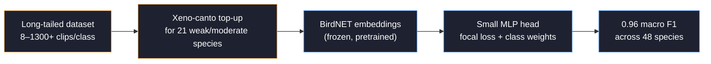
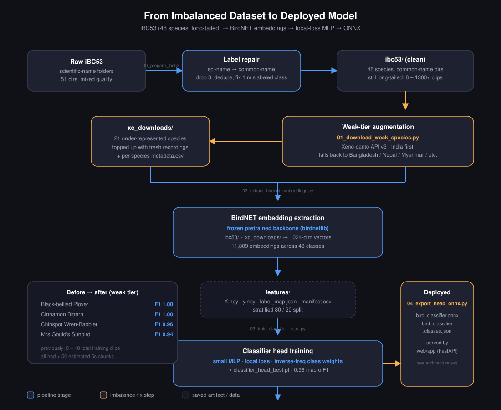
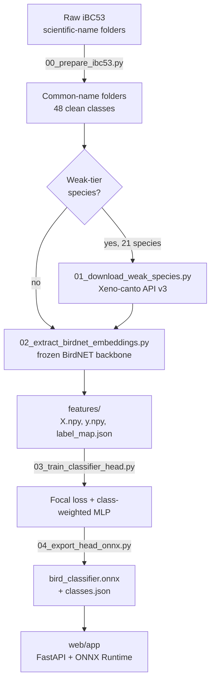
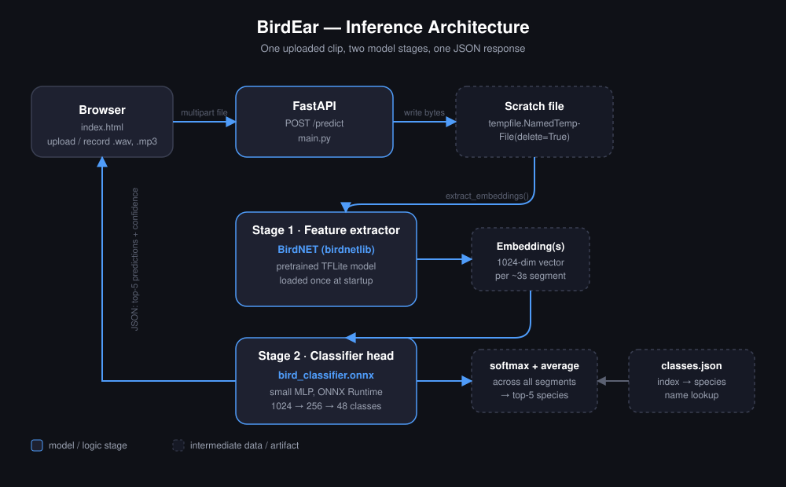
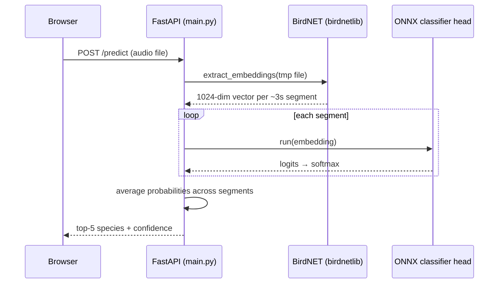

# BirdEar 🐦

**Identify Indian bird species from audio — 48 species, transfer-learned from BirdNET, served over a web UI.**

<p>
  
  
  
  
</p>

Upload a clip (or record one in-browser) → get the top-5 species with confidence scores.

---

## Why this exists

The original dataset (iBC53, 48 Indian bird species after cleanup) is heavily long-tailed:

| | |
|---|---|
| Largest class | 1,300+ clips (Puff-throated Babbler) |
| Smallest classes | under 20 clips (Black-bellied Plover, Cinnamon Bittern, Chinspot Wren-Babbler...) |
| Ratio | ~90:1 |

A CNN trained from scratch on this simply never learns the tail. The fix here is two-pronged: **top up the rarest classes with more real recordings**, and **stop training a spectrogram CNN from scratch** in favor of a frozen, globally-pretrained bioacoustic backbone.



## Results

| Metric | Before (from-scratch CNN, imbalanced) | After (BirdNET embeddings + focal loss) |
|---|---|---|
| Weak-tier species usable? | No — effectively ignored | Yes — 0.82–1.00 F1 |
| Macro F1 (48 classes) | not meaningfully measurable | **0.96** |
| Model size (classifier head) | ~31 MB (EfficientNet-B2) | ~a few hundred KB (MLP) |

Full per-class precision/recall/F1 is in [`features/`](./features) after running the training script — see below.

## Pipeline





## Architecture (inference)





## Project structure

```
.
├── ibc53/                      # cleaned, common-name-labeled training audio (48 classes)
├── xc_downloads/                # extra Xeno-canto recordings for weak-tier species
├── features/                    # BirdNET embeddings + trained classifier head
├── scripts/
│   ├── 00_prepare_ibc53.py       # scientific → common name, dedupe, drop excluded classes
│   ├── 01_download_weak_species.py   # top up rare species from Xeno-canto
│   ├── 02_extract_birdnet_embeddings.py  # frozen BirdNET → 1024-dim embeddings
│   ├── 03_train_classifier_head.py   # focal loss + class-weighted MLP training
│   └── 04_export_head_onnx.py        # export trained head to ONNX for serving
├── web/
│   └── app/
│       ├── main.py               # FastAPI backend (BirdNET + ONNX inference)
│       └── static/index.html     # upload / record UI
├── bird_classifier.onnx          # deployed classifier head
└── bird_classifier.classes.json  # index → species name
```

## Quickstart

```bash
# 1. install
pip install -r requirements.txt

# 2. clean + relabel the raw dataset
python scripts/00_prepare_ibc53.py --data_dir ./ibc53 --delete-dropped

# 3. (optional) top up weak-tier species with more Xeno-canto recordings
python scripts/01_download_weak_species.py --api_key $XC_API_KEY

# 4. extract BirdNET embeddings for the full dataset
python scripts/02_extract_birdnet_embeddings.py \
    --data_dirs ./ibc53 ./xc_downloads \
    --out_dir ./features

# 5. train the classifier head
python scripts/03_train_classifier_head.py --features_dir ./features

# 6. export to ONNX for serving
python scripts/04_export_head_onnx.py \
    --checkpoint ./features/classifier_head_best.pt \
    --label_map  ./features/label_map.json \
    --output     ./bird_classifier.onnx

# 7. run the web app
cd web/app && uvicorn main:app --reload
```

## Species covered

48 Indian bird species — see [`bird_classifier.classes.json`](./bird_classifier.classes.json) for the full list.

## Credits

- [BirdNET-Analyzer](https://github.com/kahst/BirdNET-Analyzer) (K. Lisa Yang Center for Conservation Bioacoustics, Cornell Lab of Ornithology) — pretrained bioacoustic backbone, used via [birdnetlib](https://github.com/joeweiss/birdnetlib)
- [Xeno-canto](https://xeno-canto.org) — supplementary recordings for underrepresented species
- iBC53 — base training dataset
