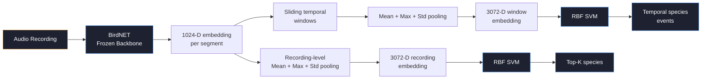
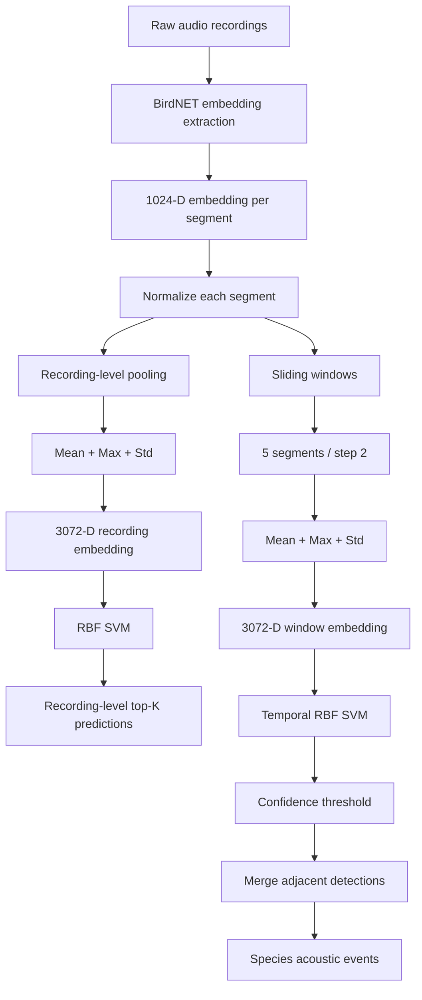
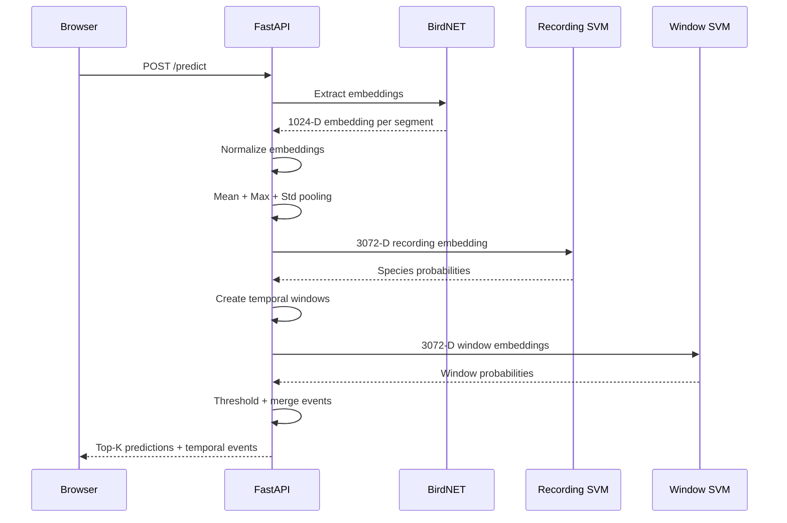

# BirdEar 🐦

**Identify Indian bird species from audio using BirdNET embeddings and SVM-based classification, with temporal event detection for locating bird activity within a recording.**

<p>


</p>

Upload an audio clip or record one in-browser → BirdNET extracts acoustic embeddings → the recording-level classifier predicts the most likely species → a temporal classifier scans the recording in overlapping windows to identify species-specific acoustic events.

---

## Why this exists

Bird recordings are not clean, single-event classification problems. A single recording can contain:

* multiple bird species
* background noise
* silence
* overlapping calls
* repeated calls from the same species
* species that occur only briefly within the recording

A single prediction for the entire recording is therefore insufficient when the goal is to understand **which species occur and approximately when they are active**.

BirdEar uses a frozen, pretrained **BirdNET** acoustic representation and separates the problem into two stages:

1. **Recording-level species classification**
   Aggregate the BirdNET embeddings from the complete recording and classify the recording using an RBF SVM.

2. **Temporal species-event detection**
   Divide the recording into overlapping windows, classify each window using a dedicated RBF SVM, and merge adjacent detections into acoustic events.


```mermaid
flowchart LR

    A["Audio Recording"] --> B["BirdNET\nFrozen Backbone"]

    B --> C["1024-D embedding\nper segment"]

    C --> D["Recording-level\nMean + Max + Std pooling"]

    D --> E["3072-D recording\nembedding"]

    E --> F["RBF SVM"]

    C --> G["Sliding temporal\nwindows"]

    G --> H["Mean + Max + Std pooling"]

    H --> I["3072-D window\nembedding"]

    I --> J["RBF SVM"]

    F --> K["Top-K species"]

    J --> L["Temporal species\nevents"]

    style A fill:#1e2130,stroke:#f9b04f,color:#fff
    style B fill:#1e2130,stroke:#4f9cf9,color:#fff
    style F fill:#1e2130,stroke:#4f9cf9,color:#fff
    style J fill:#1e2130,stroke:#4f9cf9,color:#fff
    style K fill:#1e2130,stroke:#4f9cf9,color:#fff
    style L fill:#1e2130,stroke:#4f9cf9,color:#fff
```

---

## Results

### Recording-level classification

The current recording-level evaluation uses a **recording-disjoint train/validation split**:

| Metric                |     Result |
| --------------------- | ---------: |
| Species classes       |     **83** |
| Unique recordings     |  **4,528** |
| Training recordings   |  **3,622** |
| Validation recordings |    **906** |
| Recording accuracy    | **89.29%** |
| Macro F1              |  **~0.82** |
| Weighted F1           |  **~0.88** |

The model operates on a 3072-dimensional representation produced by concatenating the mean, maximum, and standard deviation of normalized BirdNET segment embeddings.

### Temporal window classification

A separate temporal SVM was trained using windows of **5 consecutive BirdNET segments**, with a step size of **2 segments**.

| Metric             |         Result |
| ------------------ | -------------: |
| Window size        | **5 segments** |
| Window step        | **2 segments** |
| Training windows   |      **5,824** |
| Validation windows |      **4,538** |
| Window accuracy    |     **87.09%** |
| Macro F1           |      **~0.80** |
| Weighted F1        |      **~0.87** |

The temporal model is intended to provide **relative temporal localization of acoustic activity**, rather than a direct measurement of individual bird counts.

> **Important:** the temporal training labels are inherited from the recording-level species label. Consequently, a window-level prediction should not be interpreted as a ground-truth bird-presence annotation. Temporal event counts currently represent **merged acoustic events**, not confirmed individual bird counts.

---

## Pipeline


```mermaid
flowchart TD

    A["Raw audio recordings"] 
        --> B["BirdNET embedding extraction"]

    B --> C["1024-D embedding per segment"]

    C --> D["Normalize each segment"]

    D --> E["Recording-level pooling"]

    E --> F["Mean + Max + Std"]

    F --> G["3072-D recording embedding"]

    G --> H["RBF SVM"]

    H --> I["Recording-level top-K predictions"]

    D --> J["Sliding windows"]

    J --> K["5 segments / step 2"]

    K --> L["Mean + Max + Std"]

    L --> M["3072-D window embedding"]

    M --> N["Temporal RBF SVM"]

    N --> O["Confidence threshold"]

    O --> P["Merge adjacent detections"]

    P --> Q["Species acoustic events"]
```

---

## Feature extraction

BirdEar uses the **BirdNET model as a frozen feature extractor** rather than training an acoustic neural network from scratch.

For every audio recording, BirdNET produces a sequence of **1024-dimensional segment embeddings**.

For a recording containing embeddings:

```text
e1, e2, e3, ... , en
```

each embedding is first L2-normalized.

Three statistics are then calculated across the temporal dimension:

```text
mean = mean(e1, e2, ... , en)

max  = max(e1, e2, ... , en)

std  = std(e1, e2, ... , en)
```

These are concatenated:

```text
[mean | max | std]
```

resulting in:

```text
1024 + 1024 + 1024 = 3072 dimensions
```

The final 3072-dimensional vector is L2-normalized before being passed to the SVM.

This representation captures complementary information:

* **Mean pooling** — overall acoustic characteristics of the recording
* **Max pooling** — strongest feature activation occurring anywhere in the recording
* **Standard deviation pooling** — variation across the recording

The same pooling strategy is used for temporal windows.

---

## Recording-level classifier

The recording-level classifier is an **RBF-kernel Support Vector Machine**.

```text
BirdNET segments
       ↓
L2 normalization
       ↓
Mean + Max + Std pooling
       ↓
3072-D vector
       ↓
L2 normalization
       ↓
RBF SVM
       ↓
Top-K species predictions
```

The trained model is stored as:

```text
features/recording_svm.pkl
```

The class mapping is stored in:

```text
features/label_map.json
```

The recording-level model uses `predict_proba()` to obtain class probability estimates for ranking the predicted species.

---

## Temporal event detection

The recording-level classifier answers:

> **Which species is most likely present in the recording?**

That alone cannot tell us **when** a species occurs.

The temporal pipeline therefore preserves the individual BirdNET segment embeddings and timestamps.

### Sliding window

The current temporal model uses:

```text
Window size = 5 BirdNET segments
Step size   = 2 segments
```

For each window:

```text
5 × 1024-D embeddings
        ↓
Mean + Max + Std pooling
        ↓
3072-D window representation
        ↓
Temporal RBF SVM
        ↓
Species probabilities
```

Windows exceeding the configured confidence threshold are retained.

Adjacent detections belonging to the same species are then merged when their temporal gap is sufficiently small.

```text
Window detections
       ↓
Confidence filtering
       ↓
Group by species
       ↓
Sort chronologically
       ↓
Merge overlapping / nearby windows
       ↓
Acoustic events
```

The temporal model is stored as:

```text
features/window_svm.pkl
```

---

## Event output

A temporal detection contains information such as:

```json
{
    "species": "White-throated Kingfisher",
    "event_count": 2,
    "estimated_count": 2,
    "confidence": 0.2757,
    "events": [
        {
            "start_time": 72.0,
            "end_time": 87.0,
            "confidence": 0.2757,
            "windows": 1
        }
    ]
}
```

### Important terminology

`event_count` represents the number of **merged acoustic activity events**.

It should **not** currently be interpreted as the number of individual birds.

For example:

```text
1 bird calling 5 times
```

could produce multiple acoustic events, while:

```text
2 birds calling simultaneously
```

could potentially produce one merged event.

Actual individual-bird counting would require a separate detection/counting methodology and appropriate annotated data.

---

## Inference architecture


```mermaid
sequenceDiagram

    participant U as Browser
    participant S as FastAPI
    participant B as BirdNET
    participant R as Recording SVM
    participant W as Window SVM

    U->>S: POST /predict
    S->>B: Extract embeddings
    B-->>S: 1024-D embedding per segment

    S->>S: Normalize embeddings

    S->>S: Mean + Max + Std pooling
    S->>R: 3072-D recording embedding
    R-->>S: Species probabilities

    S->>S: Create temporal windows
    S->>W: 3072-D window embeddings
    W-->>S: Window probabilities

    S->>S: Threshold + merge events

    S-->>U: Top-K predictions + temporal events
```

---

## Project structure

```text
.

├── ibc53/
│   └── ...                       # Training audio
│
├── features/
│   ├── X.npy                     # BirdNET segment embeddings
│   ├── y.npy                     # Recording-level labels
│   ├── manifest.csv              # Recording / segment metadata
│   ├── label_map.json            # Species ↔ class ID mapping
│   ├── recording_svm.pkl         # Recording-level RBF SVM
│   ├── window_svm.pkl            # Temporal-window RBF SVM
│   └── window_validation_predictions.csv
│
├── scripts/
│   └── 02_extract_birdnet_embeddings.py
│
├── web/
│   └── app/
│       ├── main.py               # FastAPI backend
│       └── static/
│           └── index.html        # Upload / recording UI
│
└── README.md
```

---

## Quickstart

### 1. Install dependencies

```bash
pip install -r requirements.txt
```

### 2. Extract BirdNET embeddings

The embedding extraction stage generates the 1024-dimensional BirdNET representations and stores the segment metadata.

```bash
python scripts/02_extract_birdnet_embeddings.py
```

The resulting feature files are stored in:

```text
features/
```

### 3. Train the classifiers

The recording-level SVM is trained using recording-level pooled embeddings.

The temporal SVM is trained using sliding windows over the BirdNET segment embeddings.

The resulting models are:

```text
features/recording_svm.pkl
features/window_svm.pkl
```

### 4. Run the web application

```bash
cd web/app
uvicorn main:app --reload
```

Open the application in a browser and upload or record an audio clip.

---

## Inference workflow

For an uploaded recording, the backend performs the following:

```text
1. Receive audio
       ↓
2. Extract BirdNET embeddings
       ↓
3. Preserve segment timestamps
       ↓
4. Recording-level classification
       ↓
5. Generate temporal windows
       ↓
6. Window-level classification
       ↓
7. Apply confidence threshold
       ↓
8. Merge adjacent detections
       ↓
9. Return JSON response
```

The API returns:

```json
{
    "predictions": [...],
    "species_detected": [...]
}
```

`predictions` contains the recording-level species predictions.

`species_detected` contains the temporally localized acoustic events.

---

## Species covered

The current classifier covers **83 bird species** represented in the training dataset.

The complete class mapping is available in:

```text
features/label_map.json
```

---

## Model design decisions

### Why BirdNET?

BirdNET provides a pretrained bioacoustic representation learned from large-scale bird audio.

Using BirdNET as a frozen backbone avoids the need to train a complete acoustic representation from scratch and allows the project to focus on the classification layer and temporal processing.

### Why mean + max + standard deviation pooling?

A recording can contain multiple acoustic conditions and a species may only produce a strong signal during a small portion of the recording.

Mean pooling captures the overall representation, max pooling preserves strong activations, and standard deviation captures temporal variation.

The resulting 3072-dimensional representation performed better on the recording-level validation set than mean pooling alone.

### Why a separate temporal classifier?

The recording classifier and temporal detector solve different problems.

The recording classifier sees the complete recording and answers:

```text
"What species are represented in this recording?"
```

The temporal classifier operates on local windows and attempts to answer:

```text
"Which species is most strongly represented in this part of the recording?"
```

Using the same classifier for both tasks would create a mismatch between the training objective and the inference task.

---

## Current limitations

### Weak temporal supervision

The temporal classifier currently inherits the species label of its source recording.

Therefore, all windows from a recording receive the same training label even when the target bird may only call during a small portion of the recording.

This means the temporal model should currently be interpreted as an **acoustic activity localization system**, not as a fully supervised bird-call detector.

### Confidence scores

The SVM `predict_proba()` values are probability estimates used for ranking and thresholding.

They should not automatically be interpreted as perfectly calibrated probabilities of true bird presence.

### Individual bird counting

The current `estimated_count` represents the number of merged acoustic events.

It does not represent a verified count of individual birds.

Reliable bird counting would require additional temporal annotation and/or source-separation or multi-object acoustic detection methods.

---

## Credits

* [BirdNET-Analyzer](https://github.com/kahst/BirdNET-Analyzer) — pretrained bioacoustic model and representation
* [birdnetlib](https://github.com/joeweiss/birdnetlib) — Python interface used for BirdNET inference
* iBC53 — source bird audio dataset

---

## License

See the repository license and the respective licenses / usage terms of the datasets and pretrained models used by this project.
