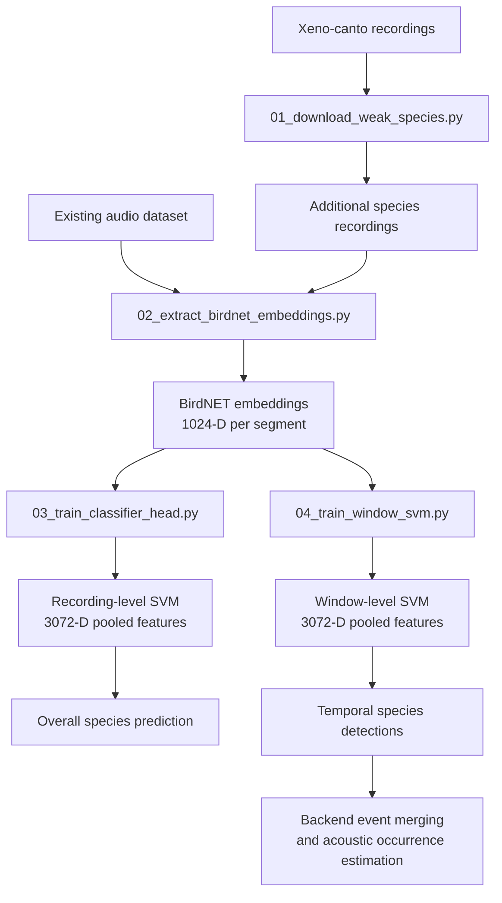

# Bird call classification pipeline

Four scripts, run in order:

## 1. `01_download_weak_species.py`

Downloads bird recordings from **Xeno-canto** for the configured Maharashtra-region target species.

### What it does

- Uses the Xeno-canto API v3.
- Searches **India first** for each species in `TARGET_SPECIES`.
- If fewer than `--min_per_species` recordings are found, automatically searches neighboring countries:
  - Bangladesh
  - Nepal
  - Sri Lanka
  - Myanmar
  - Bhutan
  - Pakistan
- Removes duplicate recordings using the Xeno-canto recording ID.
- Skips recordings that have already been downloaded.
- Saves recordings as `.mp3`.
- Creates a `metadata.csv` inside each species folder containing recording ID, country, quality, length, recordist, license, and Xeno-canto URL.
- `--preview` can be used to check India recording availability without downloading files.

### Usage

```bash
python 01_download_weak_species.py --out_dir ./xc_maharashtra --api_key $XC_API_KEY
```

Preview availability:

```bash
python 01_download_weak_species.py --preview
```

The API key can also be supplied through the `XC_API_KEY` environment variable.

---

## 2. `02_extract_birdnet_embeddings.py`

Extracts **1024-dimensional BirdNET embeddings** from every supported audio file in the supplied dataset directories.

### What it does

- Accepts one or more dataset roots through `--data_dirs`.
- Expects each dataset root to contain one folder per species.
- Supports `.wav`, `.mp3`, `.flac`, `.ogg`, and `.m4a` input files.
- Loads the BirdNET-Analyzer model once and reuses it for all files.
- Extracts embeddings for each BirdNET segment in each recording.
- Associates every embedding with its species label.
- Records the source file and segment start/end times in `manifest.csv`.
- Continues processing if an individual audio file fails.

### Usage

```bash
python 02_extract_birdnet_embeddings.py \
    --data_dirs ./ibc53_processed ./xc_maharashtra \
    --out_dir ./features
```

### Output

```text
features/
├── X.npy
├── y.npy
├── label_map.json
└── manifest.csv
```

Where:

- `X.npy` — BirdNET embedding vectors with shape `(N, 1024)`
- `y.npy` — integer class labels
- `label_map.json` — species name to integer label mapping
- `manifest.csv` — source file, species, and segment time information

---

## 3. `03_train_classifier_head.py`

Trains the **recording-level SVM classifier** using the BirdNET embeddings generated by script 02.

### What it does

- Uses the frozen BirdNET embeddings as input features.
- Aggregates the segment embeddings belonging to a recording using:
  - mean pooling
  - max pooling
  - standard-deviation pooling
- Concatenates these into a **3072-dimensional recording-level feature vector**.
- L2-normalizes the resulting feature vector.
- Trains an **RBF SVM** classifier.
- Uses `C=10` and `gamma="scale"`.
- Enables probability estimates for prediction confidence.
- Evaluates the classifier using a recording-disjoint validation split.
- Reports overall accuracy and per-class precision, recall, and F1.
- Saves the trained recording-level classifier for use by the application.

### Usage

```bash
python 03_train_classifier_head.py --features_dir ./features
```

This model answers:

> **Which species is most likely present in this recording?**

---

## 4. `04_train_window_svm.py`

Trains the **window-level SVM classifier** used for temporal bird-call detection within a recording.

### What it does

- Uses the BirdNET segment embeddings generated by script 02.
- Groups consecutive BirdNET segments into overlapping temporal windows.
- Uses **5 segments per window** with a **step size of 2 segments**.
- Applies the same mean + max + standard-deviation pooling used by the recording-level classifier.
- Produces a 3072-dimensional feature vector for each window.
- Uses a recording-disjoint train/validation split.
- Limits the number of training windows taken from each recording to prevent recordings with many windows from dominating training.
- Trains an **RBF SVM** with:
  - `C=10`
  - `gamma="scale"`
  - `class_weight="balanced"`
  - probability estimates enabled.
- Saves the trained model as `window_svm.pkl`.

### Usage

```bash
python 04_train_window_svm.py --features_dir ./features
```

This model answers:

> **Which species is detected in this part of the recording, and when does the detection occur?**

The backend uses the resulting window predictions to identify temporal detection events, merge nearby detections, and estimate separated acoustic occurrences.

---

## Pipeline



## Notes

- Adjust `TARGET_SPECIES` in script 1 if your final class list changes.
- Script 1 automatically expands to neighboring countries (Bangladesh, Nepal, Sri Lanka, Myanmar, Bhutan, Pakistan) if India alone doesn't return enough recordings for a species — same vocalizations, more data.
- `--min_per_species` controls when the fallback-country search is triggered. Its default value is `15`.
- Script 1 stores Xeno-canto metadata for provenance tracking.
- `birdnetlib` needs `ffmpeg` installed on your system PATH.
- Script 2 can receive multiple dataset directories through `--data_dirs`, allowing the existing dataset and newly downloaded Xeno-canto recordings to be processed together.
- Script 3 performs **recording-level classification**, while script 4 performs **window-level temporal classification**.
- The window-level labels are inherited from the source recording. Therefore, a window from a recording labelled as a particular species is not guaranteed to contain that species. Window-level training is consequently **weakly supervised**.
- The window-level model is intended for temporal detection/localization rather than providing ground-truth labels for individual windows.
- The backend merges nearby temporal detections before estimating separated acoustic occurrences.
- `estimated_count` is an **approximate acoustic-occurrence count**, not a guaranteed count of individual birds. One bird can produce multiple acoustic occurrences.
- If a class is still starved for data after step 1, consider merging it into a coarser label (e.g. genus-level) rather than force-fitting a 50-way classifier — the per-class report from step 3 will help identify classes that still perform poorly.
- The recording-level and window-level SVMs are separate models trained for different stages of the prediction pipeline.